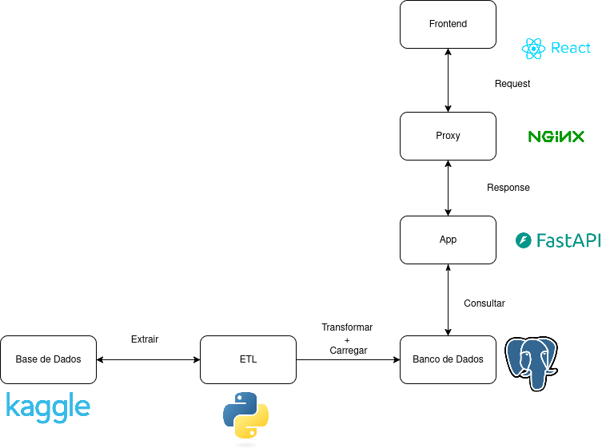
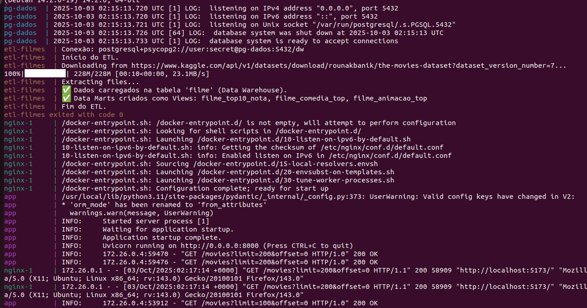
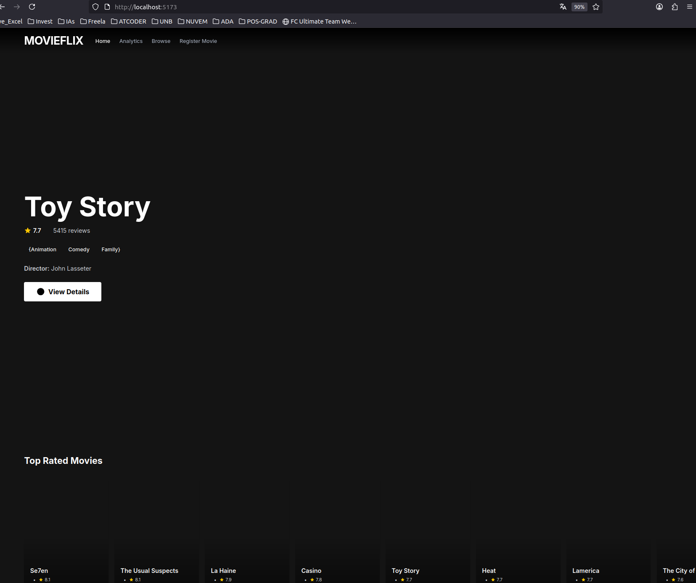
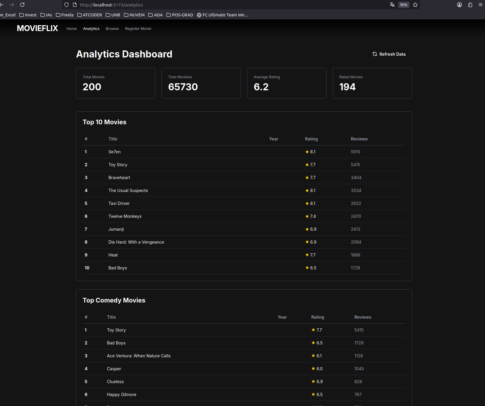
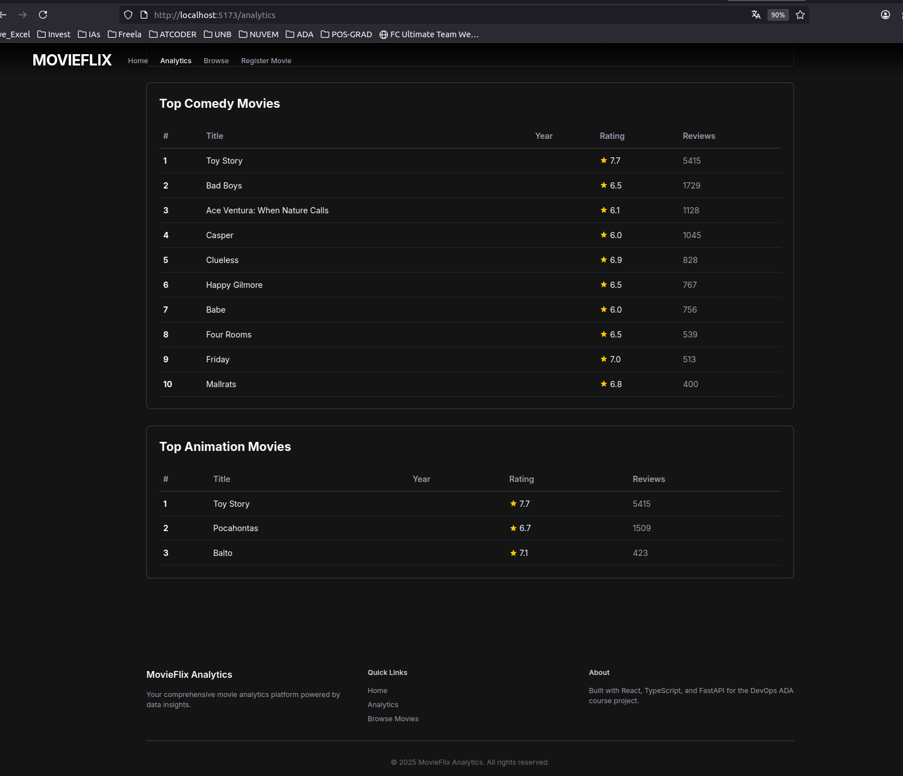
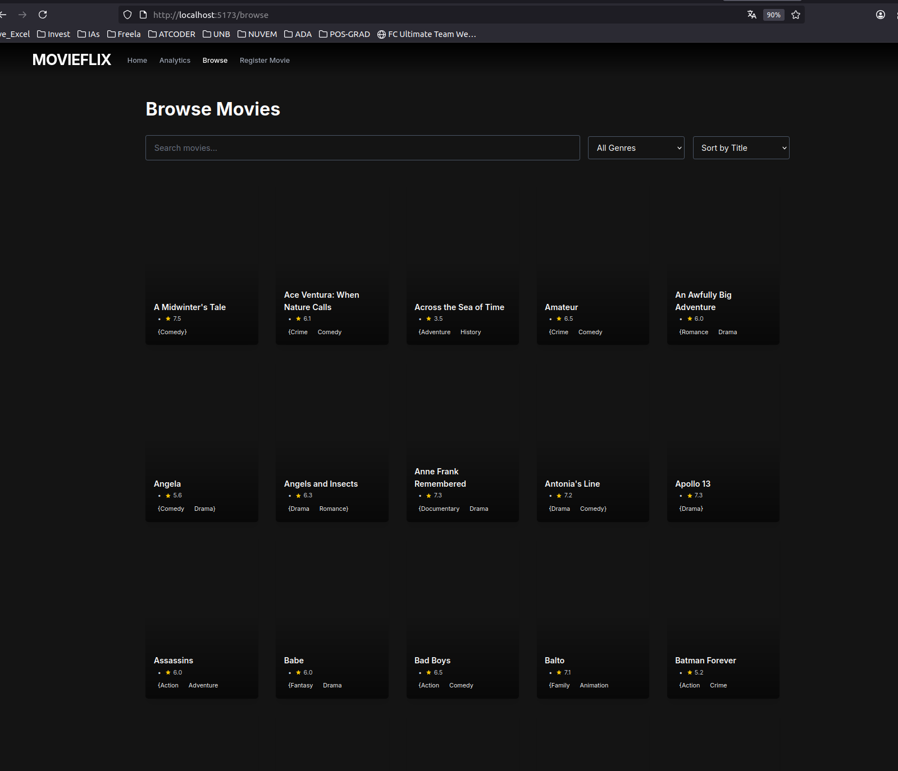
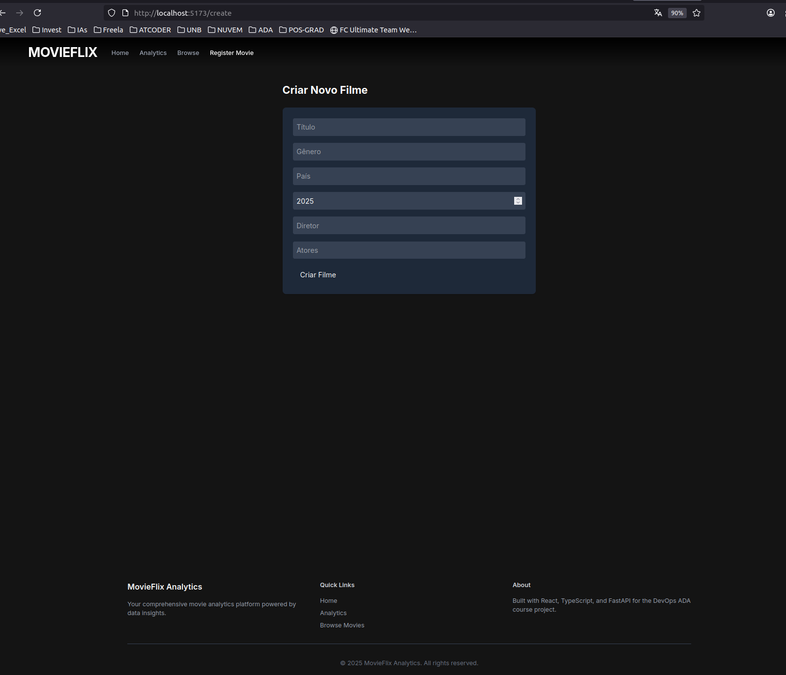
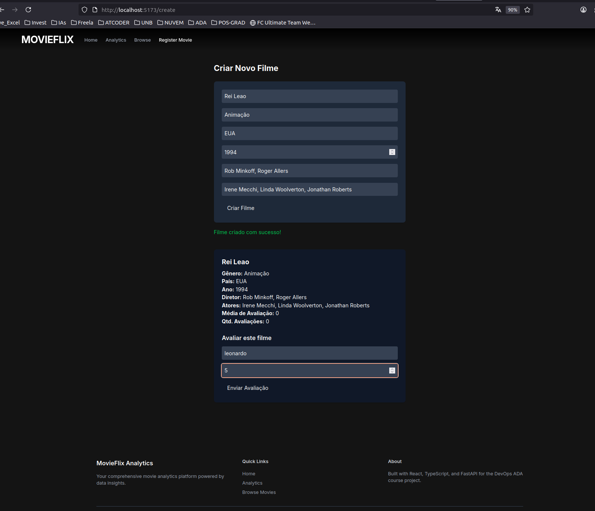

# 🎬 MovieFlix Analytics

**MovieFlix Analytics** é uma plataforma fictícia de streaming de filmes, desenvolvida para demonstrar **o ciclo completo de desenvolvimento de uma aplicação web + pipeline de dados + CI/CD com Docker**.  
O sistema permite cadastrar filmes, avaliá-los e extrair **insights de negócio** a partir dessas avaliações através de um fluxo ETL com Data Lake, Data Warehouse e Data Marts.

---

## Sumário

- [Arquitetura Geral](#-arquitetura-geral)
- [1. Aplicação Web](#1-aplicação-web)
- [2. Pipeline ETL + Data Lake/DW/Data Marts](#2-pipeline-etl--data-lakedwdata-marts)
- [3. Containerização com Docker](#3-containerização-com-docker)
- [4. Pipeline CI/CD (GitHub Actions + DockerHub)](#4-pipeline-cicd-github-actions--dockerhub)
- [5. Visões de Negócio - Data Marts](#5-visões-de-negócio---data-marts)
- [6. Como Executar o Projeto](#6-como-executar-o-projeto)


---

## Arquitetura Geral





- **Frontend:** Interface para cadastro e avaliação de filmes (React) (Densenvolvida por IA - bolt.new).
- **Backend:** API REST para gerenciar filmes e avaliações (FastAPI ou Node, containerizado).
- **ETL:** Processo em container que simula ingestão de dados no Data Lake, transformação no DW e geração de visões de negócio nos Data Marts.
- **Docker Compose:** Orquestra containers do backend, ETL e banco de dados.
- **GitHub Actions:** Faz build & push automático das imagens para o DockerHub a cada push na branch `main`.

---

## 1. Aplicação Web

###  Funcionalidades
- Cadastro de filmes.
- Avaliação de filmes com notas de 0 a 10.
- Listagem de filmes com médias atualizadas em tempo real.
- Dashboard básico com estatísticas de avaliações.

### Stack
- **Frontend:** React + Vite.
- **Backend:** FastAPI (Python) com SQLAlchemy.
- **Banco de Dados:** PostgreSQL.

---

## 2.  Pipeline ETL + Data Lake/DW/Data Marts


###  Data Lake (Dataset movies do Kaggle)

- Dataset de Movies : [kaggle movies](https://www.kaggle.com/datasets/rounakbanik/the-movies-dataset/data)
- Recebe os dados brutos das avaliações em formato CSV ou JSON.
- Simula a chegada de dados de uso real da plataforma.

### Data Warehouse (DW)
- Realiza limpeza e padronização dos dados.

### Data Marts
- Gera visões agregadas específicas para **análise de negócio**, como:
  - 10 Filmes mais bem avaliados.
  - Filmes de comédia mais bem avaliados.
  - Filmes de animação mais bem avaliados.

Os dados são armazenados em tabelas separadas no banco de dados, permitindo que **dashboards analíticos** ou queries SQL simples entreguem insights rapidamente para decisões estratégicas.

---

## 3. Containerização com Docker e docker compose

###  Estrutura de Pastas


```bash
.
├── app/ # Backend FastAPI
│ ├── Dockerfile
│ └── ...
├── etl/ # ETL Pipeline (Python)
│ ├── Dockerfile
│ └── ...
├── frontend/ # React App
│ └── ...
├── docker-compose.yml
└── .github/workflows/ci-cd.yml
```


### ETL - `Dockerfile`

```dockerfile
# Usar Python oficial
FROM python:3.11-slim

# Criar diretório de trabalho
WORKDIR /app

# Instalar dependências do sistema para psycopg2
RUN apt-get update && apt-get install -y \
    gcc \
    libpq-dev \
    && rm -rf /var/lib/apt/lists/*

# Copiar dependências e instalar
COPY requirements.txt .
RUN pip install --no-cache-dir -r requirements.txt

# Copiar script ETL e CSVs tratados
COPY etl.py .

# Rodar script
CMD ["python", "etl.py"]

```

## App - `Dockerfile`

```dockerfile
FROM python:3.11-slim
WORKDIR /app
COPY . .
RUN pip install -r requirements.txt
CMD ["uvicorn", "main:app", "--host", "0.0.0.0", "--port", "8000"]
```


## 4. Pipeline CI/CD (GitHub Actions + DockerHub)

Sempre que houver um git push na branch main:

- O pipeline constrói as imagens Docker do backend e ETL.
- Publica as imagens no DockerHub.


## 5. Visões de Negócio - Data Marts

| Data Mart                   | Descrição                                                                 |
|-----------------------------|----------------------------------------------------------------------------|
| filme_top10_nota     | Visão negocial para a empresa, pois permite analisar os 10 filmes mais bem avaliados (nota média) e que geraram renda ao longo do tempo.       |
| filme_comedia_top     | Visão negocial para a empresa, pois permite analisar os filmes por genero de comédia, sucesso entre os adultos, com a maior quantidade de avaliações e notam média em ordem decrescente.                |
| filme_animacao_top   | Visão negocial para a empresa, pois permite analisar os filmes por genero de animação, sucesso entre as crianças e adultos, com a maior quantidade de avaliações e notam média em ordem decrescente.      |


## 6. Como executar o Projeto


1. Clone o repositório

```bash
git clone https://github.com/seu-usuario/movieflix-analytics.git
cd movieflix-analytics
```

2. Substitua o `.env.example` por `.env` 

3. Suba o backend, ETL e banco

```bash
docker-compose up -d --build
```

4. Rode o frontend localmente

```bash
cd frontend
npm install
npm run dev
```


## 7. Projeto executando


Segue as evidências do projeto rodando:


















